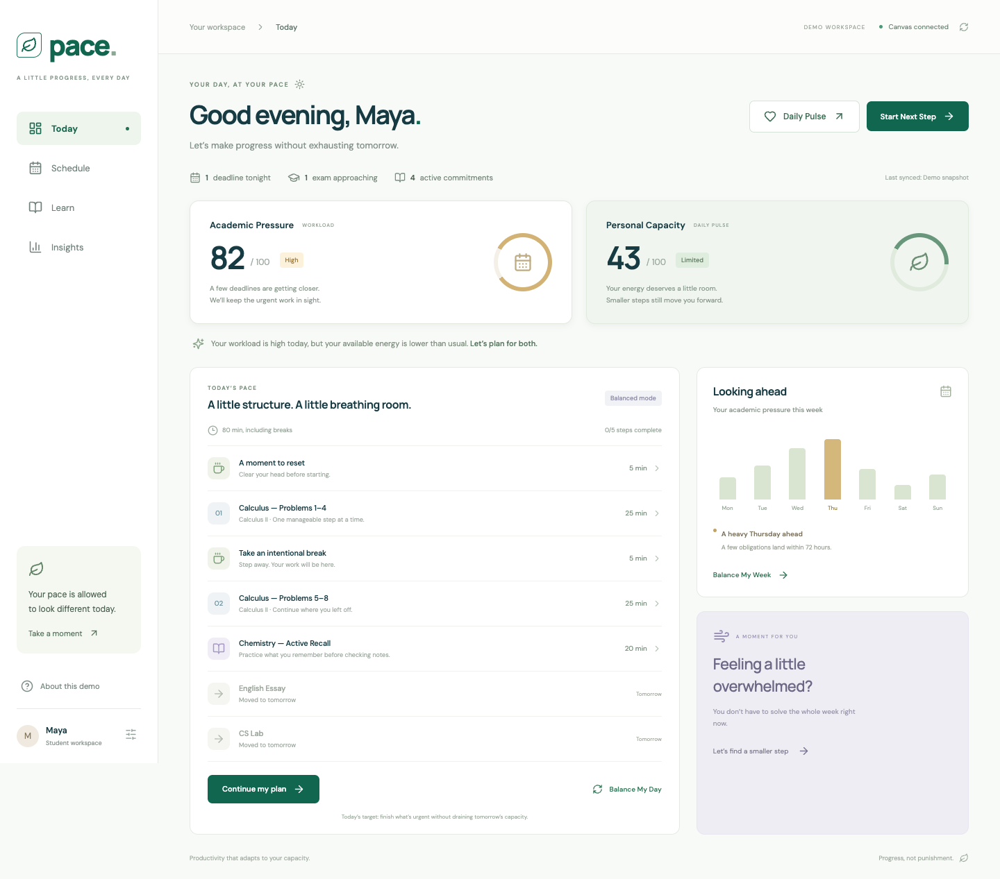

# PACE

**Productivity that adapts to your capacity.**

 PACE combines a student’s academic workload with a three-question Daily Pulse to create an achievable daily plan.




## Run

```sh
cd pace
npm install
npm run dev -- --port 5174
```

Open http://127.0.0.1:5174/ . The default `npm run dev` uses Vite's first available port starting at 5173.

```sh
npm run build
npm test
```


h.

## Implemented

Today, Daily Pulse with generation sequence, deterministic planner, Schedule and balancing, four learning modes, Reset and workload-based Narrative Shift, focus timer with pause/reset/completion, mock sync, Insights, responsive navigation, dialog keyboard focus handling and localStorage persistence.

## Demo boundaries

- Canvas data is fictional. No Canvas OAuth, real authentication, AI service, or backend exists.
- Fixed relative deadline labels keep the scenario reproducible. They do not represent a live calendar.
- Weekly balancing and historical insights are illustrative. The forecast does not claim measured health or academic outcomes.
- Capacity is `5*energy + 5*focus + 1.5*(10-stress) - 5`, clamped to 0–100.
- Academic Pressure sums urgency, capped effort volume, near-term exam pressure and a deadline-cluster term. The default data produces 82.
- Urgent work always retains its full estimated minutes. Capacity changes session length, break frequency and optional tasks. A completed step is self-reported and credits the planned duration.
- Builds retain the saved pulse, completions and demo totals on this browser. Rebuilding the day resets the active plan's completion marks.
- Narrative Shift uses a fixed workload-based template, not interpretation of journal content. Brain dumps stay only in the open dialog.
- Google Fonts supplies optional typography. System fonts provide a fallback when offline.
- PACE is a wellness/productivity prototype, not a medical assessment.

## Verification

Production TypeScript/Vite build passes. Four Node tests cover default scores, all 1,000 pulse combinations preserving urgent effort, protective versus deep-work plans, and completed assignment handling. Browser checks cover navigation, sliders, regeneration, reload persistence, balancing, four learning modes, sync, timer completion and a 390px mobile viewport.

## Built during the hackathon and future work

**Built:** React/TypeScript interface, simulated Canvas data, pressure/capacity calculations, adaptive plans, learning exercises, weekly balancing demonstration, focus timer, recovery tools, and local browser persistence.

**Future ideas:** real Canvas authorization and assignment sync, calendar-aware scheduling, longitudinal personal insights, secure account synchronization, and evaluation with students. No clinical diagnosis or proven academic/health benefit is claimed.

## Publish your repository

Create a new **public**, empty repository on GitHub. Leave the GitHub README, license and .gitignore options unchecked because this local repository already contains the project files. Then, in this folder:


